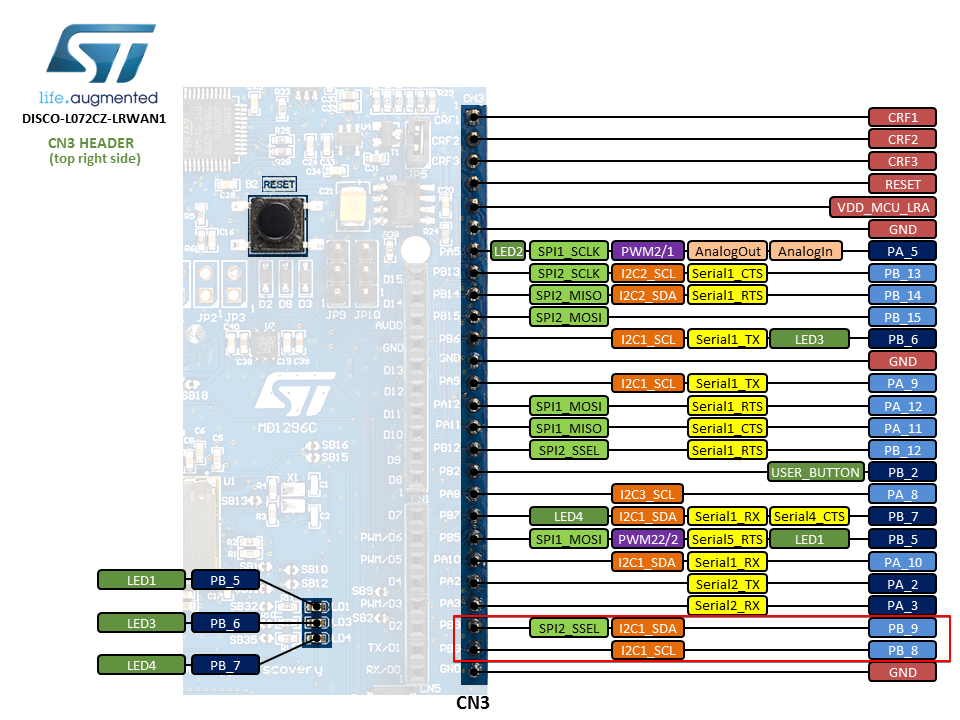

# Using B-L072Z-LRWAN1 Discovery Kit with ATECC608A-TNGLORA

The [B-L072Z-LRWAN1 LoRa®/Sigfox™ Discovery Kit](https://www.st.com/en/evaluation-tools/b-l072z-lrwan1.html) is another option for evaluating the ATECC608A-TNGLORA LoRaWAN applications.

## Connections

- Connect [AT88CKSCKTUDFN-XPRO](https://www.microchip.com/DevelopmentTools/ProductDetails/AT88CKSCKTUDFN-XPRO) to DISCO-L072CZ via `J1` header
  - `GND` on J1-7 to DISCO-L072CZ CN2 header `GND`
  - `VDD` on J1-6 to DISCO-L072CZ CN2 header `3.3V`
  - `SCL` on J1-4 to DISCO-L072CZ CN3 header SCL `PB8`
  - `SDA` on J1-3 to DISCO-L072CZ CN3 header SDA `PB9`
- To enable I2C, make AT88CKSCKTUDFN-XPRO DIP switches 1, 3 and 6 `ON` and 2,4,5,7,8 should be `OFF` as seen below.
- The DISCO-L072CZ can be powered, flashed via the STLINK micro usb.
- You can use the same micro usb to open a serial port baudrate `115200` `8N1` and observe the application logs.

## Flashing Application

 There are multiple methods to flashing your application `.bin` on this board.

 - Using the USB connection, by dragging and dropping the `.bin` to the external storage device mounted.

 - Using external debugger connected via the CN12 header, see [DISCO-L072CZ User manual](https://www.st.com/resource/en/user_manual/dm00329995-discovery-kit-for-lorawan-sigfox-and-lpwan-protocols-with-stm32l0-stmicroelectronics.pdf)
