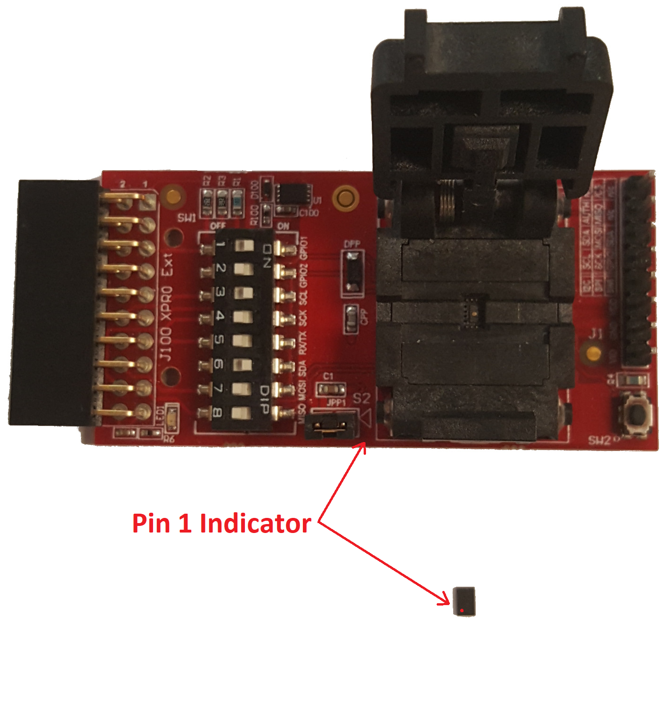
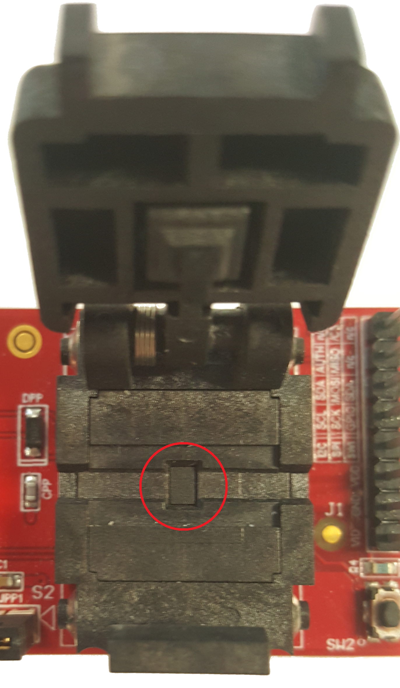

# Interfacing ATECC608A-TNGLORA 

The [ATECC608a-TNGLORA](https://www.microchip.com/wwwproducts/en/ATECC608A-TNGLORA) comes in two HW packages:

1. 8-pad UDFN
2. 8-lead SOIC

While SOIC and UDFN are not developer friendly in comparison to DIP, multiple options exist that allow for interfacing the secure element easily.

## HW Packages
### UDFN

- [AT88CKSCKTUDFN-XPRO ](https://www.microchip.com/DevelopmentTools/ProductDetails/AT88CKSCKTUDFN-XPRO) is a recommended option.

- Similar UDFN click boards can be found [here](https://www.mikroe.com/secure-udfn-click).

#### How to use?

Extensive explanation can be found [here](https://github.com/MicrochipTech/cryptoauthlib/wiki/TTN-Getting-Started#secure-element---atecc608a-tnglora).

- To enable I2C, make DIP switches 1, 3 and 6 `ON` and 2,4,5,7,8 should be `OFF` as seen below.
- Place the UDFN secure element and ensure it is seated peoperly.

 

>Note: Make sure that the Secure Element is properly seated in the socket BEFORE you close the clam shell lid. The chip should be resting evenly in the centre of the socket. It should not be tilted or misaligned. Closing the clam shell lid of the UDFN ZIF socket with the chip misaligned will cause the chip to get stuck in the socket and will become difficult to remove.

- You can power the device and connect the I2C lines in several ways.
	- Connect it directly using J100 XPRO EXT to an extension header on a supported board such as [SAMR34 Xplained Pro Evaluation Kit](https://www.microchip.com/DevelopmentTools/ProductDetails/dm320111#additional-summary), detailed connections can be seen [here](samr34_xplained.md).
	- Connect it manually PIN by PIN. Using J1 header (`GND` on J1-7 to MCU GND, `VDD` on J1-6 to MCU VDD, `SCL` on J1-4 to MCU SCL and `SDA` on J1-3 to MCU SDA).

- If the UDFN  click/socket is powered correctly, you should see the RED LED ON.

### SOIC

- [SOIC Socket Board](https://www.microchip.com/developmenttools/ProductDetails/at88ckscktsoic-xpro) is a viable option.
- [SOIC to DIP](https://www.kiwi-electronics.nl/soic-naar-dip-adapter-8-pin).
