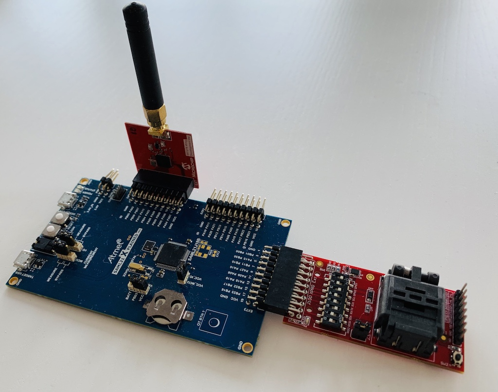

# Using SAML21 Xplained Pro Evaluation Kit with ATECC608A-TNGLORA

The [SAML21 Xplained Pro Evaluation Kit](https://www.microchip.com/DevelopmentTools/ProductDetails/PartNO/ATSAML21-XPRO-B) is an ideal development board option for evaluating the ATECC608A-TNGLORA LoRaWAN applications.

## Connections

- Connect [AT88CKSCKTUDFN-XPRO ](https://www.microchip.com/DevelopmentTools/ProductDetails/AT88CKSCKTUDFN-XPRO) to `EXT3` header as seen below.
- To enable I2C, make DIP switches 1, 3 and 6 `ON` and 2,4,5,7,8 should be `OFF` as seen below.
- Connect a LoRa radio shield to `EXT1` header.
- The board can be powered in several ways, connecting to `EDBG_USB` will power as well as interface the connected virtual com EDBG UART as well as flash the MCU if the internal debugger (EDBG) is used.
- You can use internal debugger (EDBG) or connect an external debugger for flashing, in case of external debugger, connect a proper debugger via the `CORTEX DEBUG` header, see connections in board [documentation](http://ww1.microchip.com/downloads/en/DeviceDoc/Atmel-42405-SAML21-Xplained-Pro_User-Guide.pdf).

## Flashing Application
 
 There are multiple methods to flashing your application `.bin` or `.elf` on this board.
 
 - Using internal debugger (EDBG)
 	1. Make sure you run the latest interface firmware on the SAML21 Xplained Pro board. The board should mount as USB drive (named XPLAINED). If this does not happen, start Atmel Studio and it should prompt you to update.
 	2. Flash the project by dragging and dropping the application to the mounted storage device. 	
 - Using external debugger connected via the external CORTEX DEBUG header (depends on debugger used).
