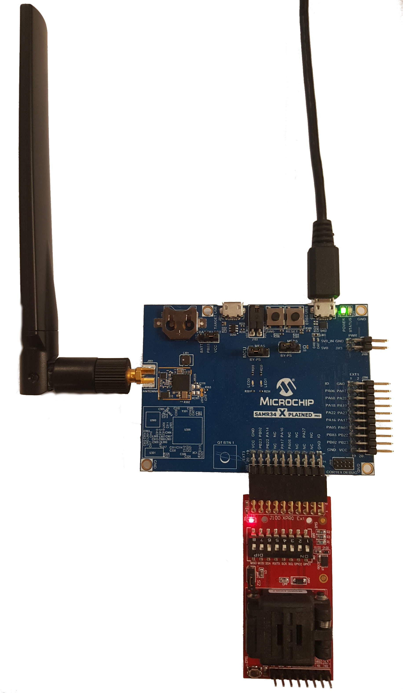

# Using SAMR34 Xplained Pro Evaluation Kit with ATECC608A-TNGLORA

The [SAMR34 Xplained Pro Evaluation Kit](https://www.microchip.com/DevelopmentTools/ProductDetails/dm320111#additional-summary) is an ideal development board option for evaluating the ATECC608A-TNGLORA LoRaWAN applications.
 
## Connections

- Connect [AT88CKSCKTUDFN-XPRO ](https://www.microchip.com/DevelopmentTools/ProductDetails/AT88CKSCKTUDFN-XPRO) to `EXT3` header as seen below.
- To enable I2C, make DIP switches 1, 3 and 6 `ON` and 2,4,5,7,8 should be `OFF` as seen below.
- The board can be powered in several ways, connecting to `EDBG_USB` will power as well as interface the connected virtual com EDBG UART as well as flash the MCU if the internal debugger (EDBG) is used.
- You can use internal debugger (EDBG) or connect an external debugger for flashing, in case of external debugger, connect a proper debugger via the `CORTEX DEBUG` header, see connections in board [documentation](http://ww1.microchip.com/downloads/en/DeviceDoc/SAM-R34-Xplained-Pro-User-Guide-DS50002803C.pdf).

## Flashing Application
 
 There are multiple methods to flashing your application `.bin` or `.elf` on this board.
 
 - Using internal debugger (EDBG)
 	1. Follow the instructions [here](https://www.segger.com/products/debug-probes/j-link/models/other-j-links/j-link-edbg/).
 	2. Flash the project by navigating to application path and running the command:
 	`$ JLinkExe -device ATSAML21J18 -if SWD -speed 4000 -autoconnect 1 -CommanderScript ./flash-jlink.txt`
 	
 - Using external debugger connected via the external CORTEX DEBUG header (depends on debugger used).