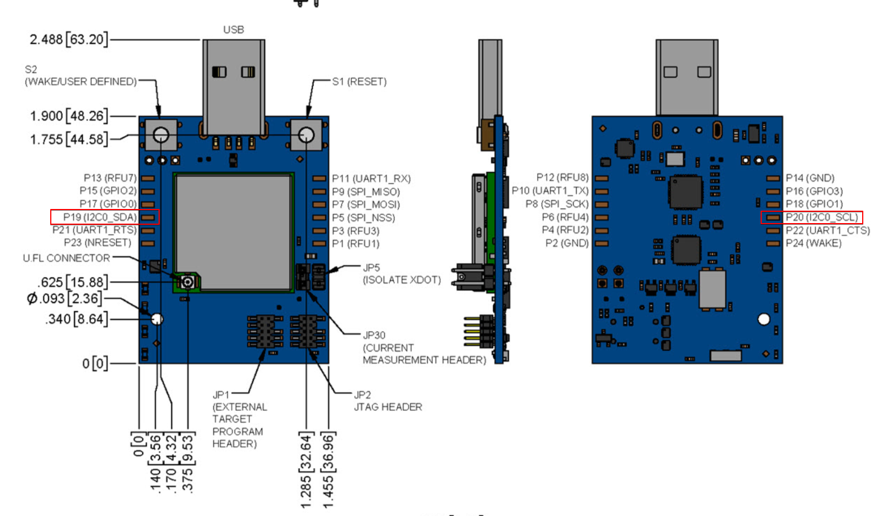

# Using xDot Micro Developer Kit with ATECC608A-TNGLORA

The [MultiTech xDot® Micro Developer Kit](https://www.multitech.com/brands/micro-xdot-devkit) is another option for evaluating the ATECC608A-TNGLORA LoRaWAN applications.
 
## Connections

- Connect [AT88CKSCKTUDFN-XPRO ](https://www.microchip.com/DevelopmentTools/ProductDetails/AT88CKSCKTUDFN-XPRO) to xdot via `J1` header (`GND` on J1-7 to xdot `GND`, `VDD` on J1-6 to xdot `3.3V`, `SCL` on J1-4 to xdot SCL `P20` and `SDA` on J1-3 to SDA `P19`).
- To enable I2C, make DIP switches 1, 3 and 6 `ON` and 2,4,5,7,8 should be `OFF` as seen below.
- The xdot can be powered, flashed via the usb.
- You can use the same usb to open a serial port and observe the application logs, see [xdot developer guide](https://www.multitech.com/documents/publications/manuals/s000645.pdf)

## Flashing Application
 
 There are multiple methods to flashing your application `.bin` on this board.
 
 - Using the USB connection, by dragging and dropping the `.bin` to the external storage device mounted.
 	
 - Using external debugger connected via the external header `JP1`, see [xdot developer guide](https://www.multitech.com/documents/publications/manuals/s000645.pdf)
